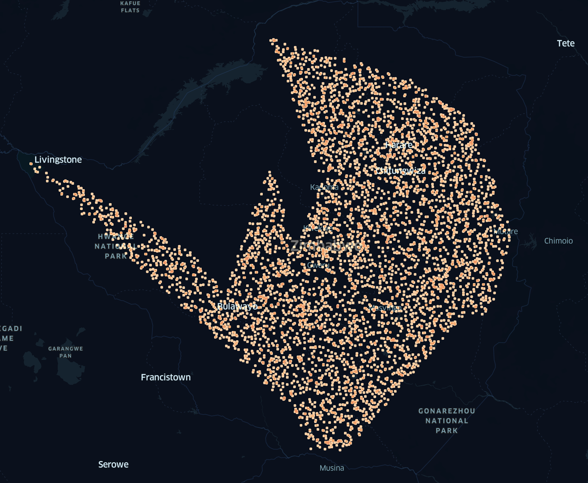

# Zimbabwe Synthetic Financial Data

## About Dataset
### Context
This dataset can be used to calculate various evaluation metrics between original credit card fraud dataset and synthetic credit card fraud dataset.
Original dataset is highly imbalanced and this synthetic credit card dataset is balanced using transactions generated using CTGAN.
Content
This dataset consists of credit card transactions but generated using CTGAN so these transactions are not real. This CTGAN model is trained using original dataset - Credit Card Fraud Detection.
* Synthetic - 10 000 000 (Fraud and Real Transactions)

## Data and Patterns
### Client
* id
* first_name
* last_name
* age
* email
* occupation
* political_views
* nationality
* university
* academic_degree
* address
* postal_code
* country
* city

### Company
* id
* type
* name
* country

### Mobile Money Agent
* id
* latitude
* longitude

### Transaction
* id
* source (points by ID to other node types)
* target (points by ID to other node types)
* date
* time
* amount
* currency

### Patterns
There are 3 types of pattern generated:
### Flow
Money starts from node A, goes through K levels, with K_N nodes on each level, and comes to a node B without a small sum payed to all network participants for their "work". Parameners:
* K (number of layers): randint(2, 6)

